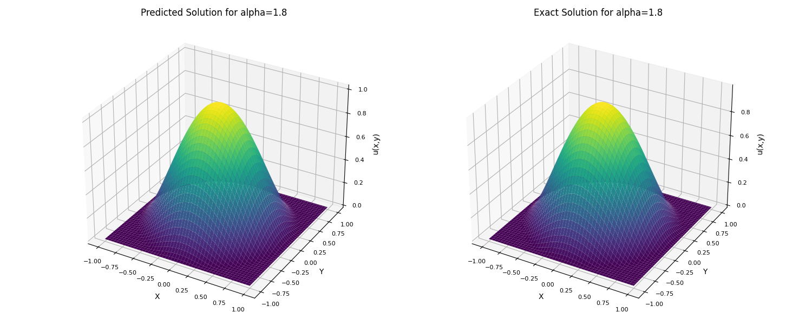
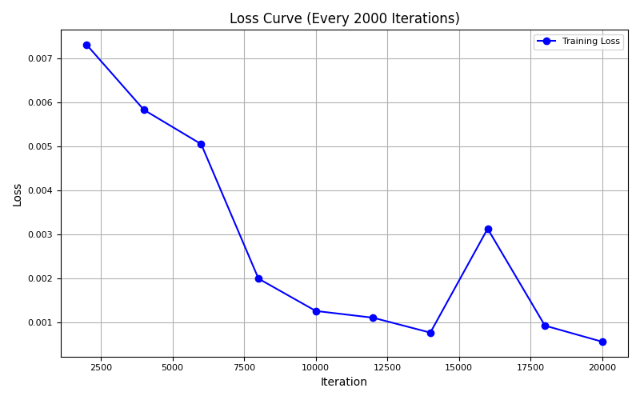

# 一、二维分数阶Possion方程

二维分数阶Possion方程形式如下：


其中$(-\Delta)^{\alpha/2}$为$\alpha$阶的拉普拉斯算子，$u(x,y)$为待求解，$f(x,y)$为已知函数。

# 二、求解原理

求解二维分数阶Possion方程的主要依据分数阶拉普拉斯算子的方向导数积分定义：


其中$C(\alpha, d)$ 是与阶数 $\alpha$ 和维度 $d$（你是二维，即 $d=2$）有关的归一化常数。$|\theta|=1$ 表示在单位圆（二维）或单位球（高维）上积分。$D_\theta^\alpha u(x)$ 是函数 $u(x)$ 沿方向 $\theta$ 的分数阶导数。

为了求解等式右边的积分，我们使用其求和近似该积分。为了保证近似的精度，我们使用高斯-勒让德函数划分角度和权重：
$$
\int_{\|\theta\|=1} D_\theta^\alpha u(x) \, d\theta 
= \int_0^{2\pi} D_\theta^\alpha u(x) \, d\phi 
\approx \sum_{i=1}^N w_i \, D_{\theta_i}^\alpha u(x)
$$
其中N代表N个角度方向，$w_i$为$\theta_i$方向的权重。

进一步为了能够实际的求出右式的分数阶导数，我们使用Grunwald-Letnikov 公式进行模拟：


其中$h > 0$ 代表背景参考点选取步长, $\quad M \in \mathbb{N}$ 代表背景参考点个数, $\quad \binom{\alpha}{k} = \frac{\Gamma(\alpha+1)}{\Gamma(k+1)\,\Gamma(\alpha - k +1)}$ 是每一个背景参考点的系数。

# 三、实验细节

我们的实验设置精确解为 $u(x, y) = \left|\,1 - (x^2+y^2)\,\right|^{1 + \frac{\alpha}{2}}$， $\alpha=1.8$ , 背景点的采样个数上限为200，步长为0.01，方向个数8。 深度神经网络的学习率为1e-3，隐藏层层数为4，每一层20个神经元。训练的域内采样点数为100，边界采样点数为100，总训练轮次为20000。训练得到的解析解与精确解的效果对比图如下：



# 四、运行

运行我们的代码至少需要如下的环境：

```
#cuda=11.1
#python=3.7
mindspore          2.2.13
sciai              0.1.0
```

运行训练与验证需要设置aiframe.py中的load_ckpt参数为False

使用已经训练好的ckpt进行验证需要设置aiframe.py中的load_ckpt参数为True

下面是训练时loss的变化参考图：

