# 一、二维分数阶Possion方程

二维分数阶Possion方程形式如下：


其中：

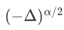为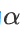阶的拉普拉斯算子

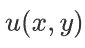为待求的解

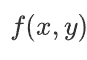为已知函数

# 二、求解原理

求解二维分数阶Possion方程的主要依据分数阶拉普拉斯算子的方向导数积分定义：


其中：

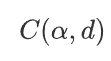是与阶数 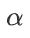和维度 $d$（你是二维，即 $d=2$)有关的归一化常数。

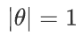表示在单位圆（二维）或单位球（高维)上积分。

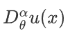是函数 $u(x)$ 沿方向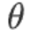的分数阶导数。

为了求解等式右边的积分，我们使用其求和近似该积分。为了保证近似的精度，我们使用高斯-勒让德函数划分角度和权重：

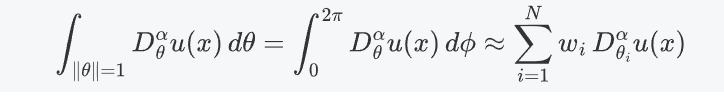

其中N代表N个角度方向，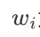为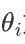方向的权重。

进一步为了能够实际的求出右式的分数阶导数，我们使用Grunwald-Letnikov 公式进行模拟：


其中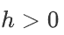代表背景参考点选取步长, 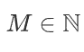 代表背景参考点个数, 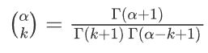 是每一个背景参考点的系数。

# 三、实验细节

我们的实验设置精确解为 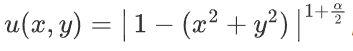， 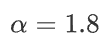 , 背景点的采样个数上限为200，步长为0.01，方向个数8。 深度神经网络的学习率为1e-3，隐藏层层数为4，每一层20个神经元。训练的域内采样点数为100，边界采样点数为100，总训练轮次为20000。训练得到的解析解与精确解的效果对比图如下：


# 四、运行

运行我们的代码至少需要如下的环境：

```
#cuda=11.1
#python=3.7
mindspore          2.2.13
sciai              0.1.0
```

运行训练与验证需要设置aiframe.py中的load_ckpt参数为False

使用已经训练好的ckpt进行验证需要设置aiframe.py中的load_ckpt参数为True

下面是训练时loss的变化参考图：

